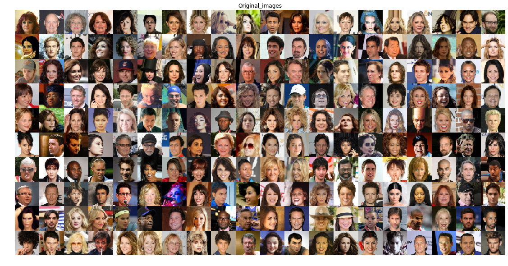
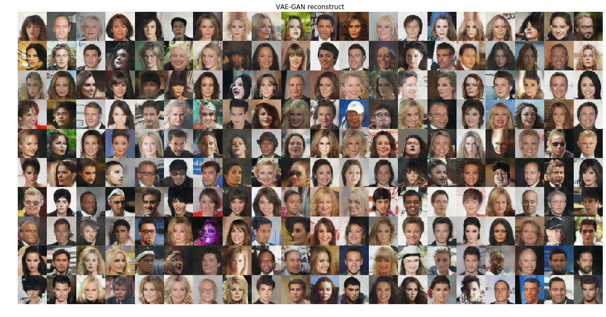
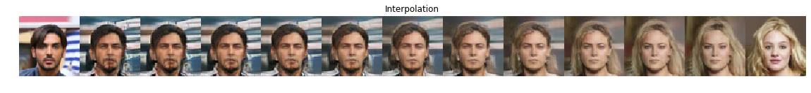
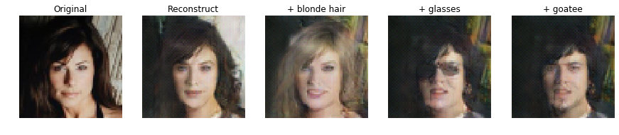

# VAE-GAN Autoencoding Beyond Pixels Using a Similarity Metric

Tensorflow implementation of the research paper [Autoencoding beyond pixels using a learned similarity metric](https://arxiv.org/abs/1512.09300).

## Some results
Testing set images:

Reconstruction of the test set images:

Interpolation between 2 images:

Playing with visual attributes:  

## Reference
1. [Autoencoding beyond pixels using a learned similarity metric](https://arxiv.org/abs/1512.09300)
1. https://github.com/zhangqianhui/vae-gan-tensorflow
1. https://github.com/timsainb/Tensorflow-MultiGPU-VAE-GAN
